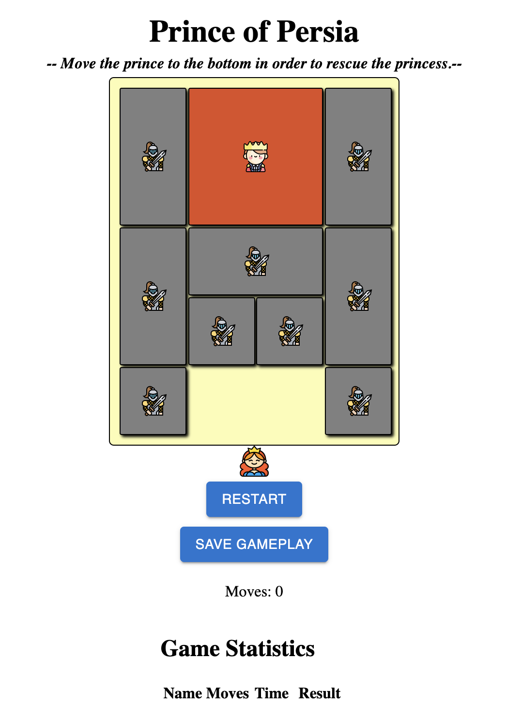

# Klotzki Game

Implementation of the famous [Klotzki Game](https://en.wikipedia.org/wiki/Klotski), using React for frontend and Google App script as backend. 



## Open Source References

* [React 17](https://react.dev) - MIT
* [react-grid-layout 1.3.4](https://github.com/react-grid-layout/react-grid-layout) - MIT
* [babel-standalone 6.26.0](https://babeljs.io/docs/babel-standalone) - MIT
* [material-ui 5.11.14](https://mui.com) - MIT
* [Flaticons](https://www.flaticon.com) - [License](h[ttps://flaticons.co/license](https://www.freepikcompany.com/legal?&_ga=2.9709813.196746592.1679815395-1293657094.1679815395&_gl=1*k39mal*test_ga*MTI5MzY1NzA5NC4xNjc5ODE1Mzk1*test_ga_523JXC6VL7*MTY3OTgzOTc5Ni40LjEuMTY3OTg0MTU2Ny4zNy4wLjA.*fp_ga*MjQ5MjIyMDgyLjE2Nzk4NDE1NjA.*fp_ga_1ZY8468CQB*MTY3OTgzOTc5Ni40LjEuMTY3OTg0MTU2Ny4zNy4wLjA.#nav-flaticon-agreement))
* [Japn-klotzki](https://github.com/ziqingW/Japan-klotski) - MIT

## License
MIT

## Running the game

### Prerequisite

* [NodeJS]( https://nodejs.org/)
* Google account
* [Google Sheet](http://sheets.google.com)

### Steps

1. Clone the repo ```git clone https://github.com/aedelmann/klotzki.git```
2. Add your Google sheet ID to the file 'Sheet.gs' and save. 

``` 
const SPREADSHEET_ID = ADD YOUR GOOGLE SHEET ID HERE;
```

3. Install clasp

``` npm install -g @google/clasp ```

4. Login to clasp 
Make sure you are in the root of the klotzki project. 
Run the following command in the terminal to log in with your Google account: ``` clasp login ```
This will open a browser window where you need to authorize clasp to access your Google account.

5. Create a new Google Apps Script project

To create a new Google Apps Script project named "Klotzki" run the following command in the terminal:

```clasp create "Klotzki" --type webapp```

6. Push changes

Push your changes to Google cloud app script server with ``` clasp push ``` 

7. Deploy application

``` clasp deploy ``` 

This command will create a new deployment of your web application. Take note of the deployment ID and web app URL shown in the terminal.
You can now access your web application by visiting the web app URL
